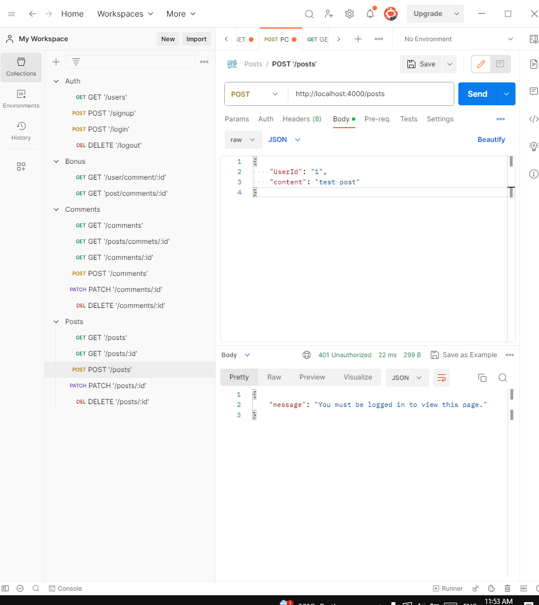

# Blog platform


## Table of Contents
- [Description](#description)
- [Installation](#installation)
- [Usage](#usage)
- [Contributing](#contributing)
- [License](#license)
- [Credits](#credits)

## Description
Blog platform allows you to add, edit, and delete posts, users, and comments. It uses sequelize to interact with the database.

## Installation
To install the blog locally, follow these steps:

1. Clone the repository:
   ```
   git clone https://github.com/AhmedHamza667/blog.git
   ```
2. Navigate to the project directory:
   ```
   cd blog
   ```
3. Install the dependencies:
   ```
   npm install
   ```
4. Run the application:
   ```
   npm start
   ```

## Usage
After installing and running the application, you can use it through API testing tool like Postman. http://localhost:4000/

## Contributing
We welcome contributions to Recipe Management. To contribute, please follow these steps:

1. Fork the repository on GitHub.
2. Create a new branch for your feature or bug fix.
3. Make your changes and ensure that the tests pass.
4. Commit your changes and push them to your fork.
5. Submit a pull request describing your changes and why they should be merged.

## Contributors
- Ahmed Hamza

## License
This project is licensed under the [MIT License](LICENSE).

## Screenshots
Please login to post

Sign Up

Log In

New post

Get all posts

Post a comment

'BONUS' Get all comments by a user

